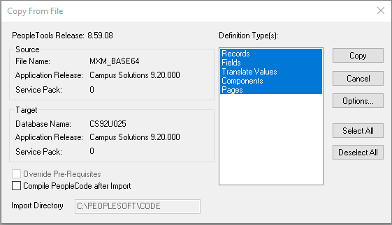

# PeopleSoft Base 64 Encode/Decode
PeopleSoft utility to perform base64 encoding or decoding in PeopleCode using PeopleSoft's Pluggable Cryptography Technology (PET) in combination with the PeopleCode Crypt Class.


## How to Install
### Step 1: Configuration    
1) Define two new algorithm chains under PeopleTools > Security > Encryption > Algorithm Chain:
```
Algorithm Chain: BASE64_ENCODE:
1 PSUnicodeToAscii
2 base64_encode
3 PSAsciiToUnicode
```

```
Algorithm Chain: BASE64_DECODE:
1 PSUnicodeToAscii
2 base64_decode
3 PSAsciiToUnicode
```


Note the sequence as they are very important and must be exactly as ordered.

2) Define Encryption Profiles using the chains above under PeopleTools > Security > Encryption Profile. As an example here, profile names BASE64_ENCODE and BASE64_DECODE will be used for the sample code below.

#### BASE64_ENCODE Profile


#### BASE64_DECODE Profile


3) After the encryption profiles are set up, they can be called upon by the PeopleCode Crypt class.

### Step 2: Import the custom menu and folder
This step will import the custom menu and folder
1. Launch Application Designer 
2. click Tools, Copy Project, From File...   
3. click Select, choose MXM_CUSTOM_INIT
4. click Copy

### Step 3: Import the project
This step will import the Base64 project 
1. click Tools, Copy Project, From File...   
2. click Select, choose MXM_BASE64
3. click Copy



### Step 4. Register the component
1. Open the component
2. Click Tools, Register Component...


## Technical Documentation
### App Designer Project: MXM_BASE64

### Records
			
Record: MXM_BASE64  

| Field | Type | Length | Long Descr | Short Descr |
| ------ | --------- | --------- | --------- | --------- | 
| DESCRLONG1 | Long | 0 | Description | Descr |         
| MXM_BASE64_ALG | Char | 4 | Algorithm | Algorithm |      
| SUBMIT_BTN | Char | 1 | Submit Button | Submit |         
| DESCRLONG | Long | 0 | Description | Descr |    

Field Name: MXM_BASE64_ALG  
Translate values

| Value | Long Name | Short Name |
| ------| --------- |------------|
| B64D | Base 64 Decode | Decode |
| B64E | Base 64 Encode | Encode |


### Pages

Page: MXM_BASE64   
Title: Base64 Encode/Decode    
MXM_BASE64.DESCRLONG1   
MXM_BASE64.MXM_BASE64_ALG   
MXM_BASE64.SUBMIT_BTN   
MXM_BASE64.DESCRLONG   


### PeopleCode

Field Event: MXM_BASE64.SUBMIT_BTN.FieldChange

```
If MXM_BASE64.MXM_BASE64_ALG.Value = "B64E" Then
   /* ENCODE */
   &cryEncode = CreateObject("Crypt");
   &cryEncode.Open("BASE64_ENCODE");
   &cryEncode.UpdateData(MXM_BASE64.DESCRLONG1.Value);
   &encodeResult = &cryEncode.Result;
   MXM_BASE64.DESCRLONG.Value = &encodeResult;
End-If;

If MXM_BASE64.MXM_BASE64_ALG.Value = "B64D" Then
   /* DECODE */
   &cryDecode = CreateObject("Crypt");
   &cryDecode.Open("BASE64_DECODE");
   &cryDecode.UpdateData(MXM_BASE64.DESCRLONG1.Value);
   &decodeResult = &cryDecode.Result;
   MXM_BASE64.DESCRLONG.Value = &decodeResult;
End-If;
```

## Component

| Component | MXM_BASE64 | 
| ------| --------- |
| Page | MXM_BASE64 | 
| Navigation | Custom Components > Base64 Encode/Decode | 
| Item Label | Base64 Encode/Decode | 
| Search Record | INSTALLATION |
| Add | Selected | 
| Update Display | Selected |
| Disable Saving Page | Selected | 
| Menu | MXM_CUSTOM_MENU |
| Bar item Name | MENUITEM | 
| Portal | Employee |
| Folder Name | MXM_CUSTOM | 
| Content Reference label | Base64 Encode/Decode |
| Long Description | Base64 Encode/Decode | 
| Sequence Number | 0 |
| Always Use Local Node | Selected | 
| Permission Lists | PTPT1200 |
| Actions | Add, Update/Display | 

## Notes
Oracle Support Doc ID 790153.1  

Example Code:
```
    Local Crypt &cryEncode, &cryDecode;
    Local string &encodeResult, &decodeResult;

    /* ENCODE */
    &cryEncode = CreateObject("Crypt");
    &cryEncode.Open("BASE64_ENCODE");
    &cryEncode.UpdateData("This is the text to be encoded");
    &encodeResult = &cryEncode.Result;

    /* DECODE */
    &cryDecode = CreateObject("Crypt");
    &cryDecode.Open("BASE64_DECODE");
    &cryDecode.UpdateData(&encodeResult);
    &decodeResult = &cryDecode.Result;
```

## Feedback:
Please create a GitHub Issue for any bugs, feature requests, etc. Happy to accept pull requests too!
